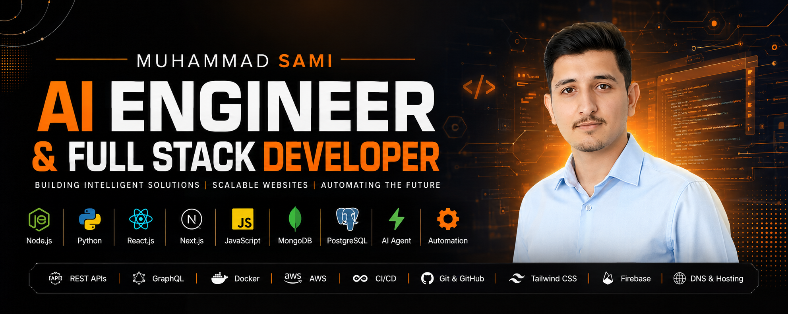

<div align="center">



# Muhammad Sami Asghar Mughal

[](https://github.com/muhammadsami987123)

**Karachi, Pakistan** &nbsp;•&nbsp; *Building AI Agents, Automation Systems, and Scalable Products*

<br/>

[](https://portfolio-sami-phi.vercel.app)
[](https://linkedin.com/in/muhammad-sami-3aa6102b8)
[](https://github.com/muhammadsami987123)
[](https://x.com/MSAMIWASEEM1)
[](mailto:m.samiwaseem1234@gmail.com)

[](https://github.com/muhammadsami987123)
[](https://github.com/muhammadsami987123)

</div>

---

## About Me

I'm an **AI Agent Engineer** and **Full Stack Developer** focused on building intelligent systems that solve real-world problems. I architect agentic AI workflows, multi-agent systems, and modern web platforms — turning ideas into production-grade products.

- **Founder** of [Marsa Empower](https://marsaempower.com) — an AI-powered women's health ecosystem
- **Founder** of CodePulse Innovations — product engineering & SaaS development
- **Cloud-Enabled Generative AI** enthusiast, building on agentic frameworks
- **Web3 & Metaverse** explorer through PIAIC & GIAIC programs
- **Open Source Contributor** and builder of AI-powered products

> I focus on **Agentic AI**, **Multi-Agent Systems**, **LLM Applications**, **AI Automation**, **Full Stack Development**, and **Product Engineering**.

---

## Current Mission

> ### Building **Marsa Empower** — a next-generation women's health ecosystem powered by AI.

A privacy-first platform combining intelligent agents with health education to deliver personalized, secure, and accessible guidance.

| Capability | Description |
|---|---|
| **AI Health Assistant** | Conversational AI for health questions and guidance |
| **AI Health Agents** | Specialized agents handling distinct health workflows |
| **Symptom Guidance** | Intelligent, context-aware symptom support |
| **Cycle Tracking** | Personalized tracking and insights |
| **Health Updates** | Timely, relevant health information |
| **Educational Resources** | Curated, trustworthy learning content |
| **Privacy-First Architecture** | Security and user data protection by design |
| **Scalable AI Infrastructure** | Built to grow with the user base |

*The platform is actively under development.*

---

## 🌸 Marsa Empower

A comprehensive **AI-powered women's health platform** designed around privacy, education, and personalized care.

🔗 **[marsaempower.com](https://marsaempower.com)**

### Features
- **AI Health Assistant** — natural-language health support
- **Health Education** — accessible, curated resources
- **Personalized Insights** — tailored to each user's profile
- **Secure User Profiles** — encrypted, user-controlled data
- **Privacy-Focused Design** — minimal data, maximum trust
- **Agent-Powered Workflows** — automated health journeys
- **Real-Time Guidance** — responsive, on-demand answers
- **Modern UI/UX** — clean, calming, accessible interface

### Roadmap
- [x] Core platform architecture & privacy model
- [x] AI Health Assistant prototype
- [ ] Multi-agent health workflow orchestration
- [ ] Cycle tracking & personalized insights engine
- [ ] Educational content library
- [ ] Public beta launch

### Future Vision
To become the most trusted AI-driven women's health companion — scaling personalized, private, and empowering care to communities worldwide.

### Technology Stack


---

## AI Agent Portfolio

**6+ AI Agents Built** across automation, productivity, and research domains.

| Category | What I Build |
|---|---|
| **Agent Automation Systems** | End-to-end agents that automate repetitive multi-step workflows |
| **Productivity Agents** | Task managers, planners, and focus tools that act on natural language |
| **Research Agents** | Agents that gather, summarize, and synthesize information from multiple sources |
| **Workflow Agents** | Process-driven agents integrating APIs and external services |
| **Custom LLM Integrations** | Tailored model interactions with function calling and structured output |
| **Agent Orchestration Experiments** | Multi-agent coordination and tool-use patterns |

---

## Technical Skills

<div align="center">

**Frontend**

[](https://skillicons.dev)

**Backend & Database**

[](https://skillicons.dev)

**AI & Agent Frameworks**


**Cloud, DevOps & Automation**

[](https://skillicons.dev)


</div>

---

## Featured Projects

<table>
<tr>
<td width="50%" valign="top">

### 🌸 [Marsa Empower](https://marsaempower.com)
AI-powered women's health platform with health agents, personalized insights, and privacy-first design.

`Next.js` `TypeScript` `OpenAI SDK` `LangChain`

</td>
<td width="50%" valign="top">

### 🤖 AI Help Center
Intelligent support system powered by AI for fast, accurate, context-aware assistance.

`Python` `OpenAI` `RAG`

</td>
</tr>
<tr>
<td width="50%" valign="top">

### 📊 E-Commerce Admin Dashboard
Modern business management dashboard with analytics, inventory, and role-based access.

`Next.js` `React` `PostgreSQL`

</td>
<td width="50%" valign="top">

### 🖱️ AI Virtual Mouse
Computer vision automation that controls the cursor through hand gestures.

`Python` `OpenCV` `MediaPipe`

</td>
</tr>
<tr>
<td width="50%" valign="top">

### 🧠 Jarvis Assistant
Personal AI assistant for voice-driven control of apps and workflows.

`Python` `Speech` `LLM`

</td>
<td width="50%" valign="top">

### ✋ Hand Detection System
Real-time computer vision application for hand tracking and gesture recognition.

`Python` `OpenCV` `MediaPipe`

</td>
</tr>
<tr>
<td width="50%" valign="top">

### ✨ Future Project
*Reserved for upcoming work.*

</td>
<td width="50%" valign="top">

### ✨ Future Project
*Reserved for upcoming work.*

</td>
</tr>
</table>

---

## GitHub Statistics

<div align="center">


<picture>
  <source media="(prefers-color-scheme: dark)" srcset="https://raw.githubusercontent.com/muhammadsami987123/muhammadsami987123/output/github-snake-dark.svg" />
  <source media="(prefers-color-scheme: light)" srcset="https://raw.githubusercontent.com/muhammadsami987123/muhammadsami987123/output/github-snake.svg" />
  
</picture>

</div>

---

## Professional Journey

```
2021  ──  Learning Programming        Foundations: logic, web fundamentals
2022  ──  Frontend Development        React, Next.js, responsive UI/UX
2024  ──  Full Stack Development      Node.js, Python, Django, databases
2024  ──  AI Engineering              LLM apps, OpenAI SDK, prompt engineering
2025  ──  Agentic AI                  Multi-agent systems, automation, n8n
2026  ──  Marsa Empower               Founding an AI-powered health ecosystem
```

---

## Open Source & Community

- **PIAIC** — Certified Cloud Applied Agentic-AI Engineer program
- **GIAIC** — Certified Cloud Applied Generative AI Engineer program
- **Hackathons** — building and shipping under time constraints
- **AI Communities** — active participation and knowledge sharing
- **Open Source** — contributing to and maintaining public projects

---

## Currently Learning


---

## Connect With Me

<div align="center">

[](https://github.com/muhammadsami987123)
[](https://linkedin.com/in/muhammad-sami-3aa6102b8)
[](https://portfolio-sami-phi.vercel.app)
[](https://x.com/MSAMIWASEEM1)

</div>

---

## Fun Facts

- Building an **offline Jarvis-style AI Assistant** that runs without the internet
- Deeply passionate about **AI Agents** and autonomous systems
- Love solving **real-world problems** through technology
- Always exploring the **future of AI and Automation**

---

<div align="center">

### Building the Future with AI Agents & Intelligent Automation

**Made by Muhammad Sami Asghar Mughal**

</div>
